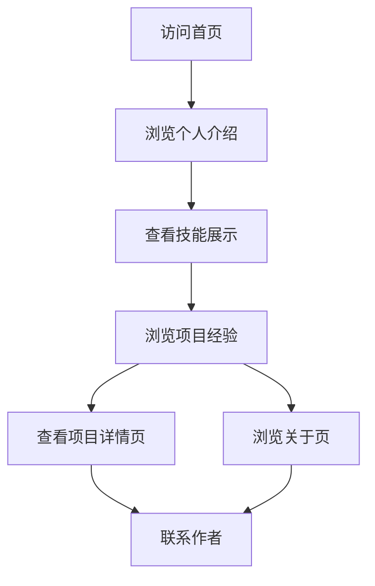

## 1. Product Overview
个人技术风格主页，展示广东科学技术职业学院商学院商务数据分析与应用专业学生陈锨濠的个人信息和技能。
- 主要目的是展示个人技术能力、项目经验和专业背景，为潜在雇主或合作伙伴提供了解渠道。
- 目标用户包括招聘方、同学、老师和行业伙伴。

## 2. Core Features

### 2.1 User Roles
| Role | Registration Method | Core Permissions |
|------|---------------------|------------------|
| Visitor | 无需注册 | 浏览所有内容 |

### 2.2 Feature Module
1. **首页**: 个人介绍、技能展示、项目经验、联系方式
2. **项目页**: 详细项目展示、技术栈说明
3. **关于页**: 个人背景、教育经历、专业技能

### 2.3 Page Details
| Page Name | Module Name | Feature description |
|-----------|-------------|---------------------|
| 首页 | 英雄区 | 个人头像、姓名、专业、简短介绍，科技风格动效 |
| 首页 | 技能展示 | AI编程、数据分析等技能图标和描述 |
| 首页 | 项目经验 | 项目卡片展示，包含项目名称、技术栈、描述 |
| 首页 | 联系方式 | 社交媒体链接、邮箱等联系方式 |
| 项目页 | 项目详情 | 详细项目描述、技术实现、成果展示 |
| 关于页 | 个人背景 | 个人简介、教育经历、专业技能详细说明 |

## 3. Core Process
用户访问网站 → 浏览首页了解基本信息 → 点击项目卡片查看详细项目信息 → 浏览关于页了解更多个人背景 → 通过联系方式进行沟通

## 4. User Interface Design
### 4.1 Design Style
- 主色调：深蓝色 (#0A192F)、亮青色 (#64FFDA)
- 辅助色：浅灰色 (#CCD6F6)、深灰色 (#8892B0)
- 按钮风格：圆角、发光效果、悬停动画
- 字体：无衬线字体，主标题使用大号字体，正文使用中等大小
- 布局风格：卡片式布局，响应式设计，科技感网格背景
- 图标风格：线性图标，科技感十足，带有轻微动效

### 4.2 Page Design Overview
| Page Name | Module Name | UI Elements |
|-----------|-------------|-------------|
| 首页 | 英雄区 | 深色背景，个人头像带有发光边框，姓名使用大号字体，带有打字机效果，背景有微妙的粒子动画 |
| 首页 | 技能展示 | 卡片式布局，每个技能带有图标和进度条，悬停时有放大效果 |
| 首页 | 项目经验 | 网格布局，项目卡片带有阴影和悬停效果，卡片内包含项目名称、技术栈标签和简短描述 |
| 首页 | 联系方式 | 图标链接，带有悬停动画，布局整洁 |
| 项目页 | 项目详情 | 大图展示，详细文字描述，技术栈标签，步骤说明 |
| 关于页 | 个人背景 | 时间线布局，教育经历和专业技能分类展示，带有图标和简短描述 |

### 4.3 Responsiveness
- 桌面优先设计，适配不同屏幕尺寸
- 移动端自适应布局，确保在手机和平板上有良好的浏览体验
- 触摸优化，确保在触摸设备上的交互流畅

### 4.4 3D Scene Guidance
- 背景可添加微妙的3D粒子效果，增强科技感
- 鼠标移动时，背景粒子可跟随移动，增加交互感
- 页面滚动时，元素可带有3D变换效果，提升视觉体验