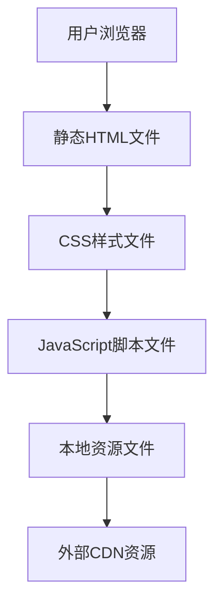

## 1. Architecture Design


## 2. Technology Description
- Frontend: 纯HTML5 + CSS3 + JavaScript (ES6+)
- 构建工具: 无（纯静态文件）
- 样式: 自定义CSS + CSS变量
- 图标: 使用Font Awesome或Material Icons
- 动画: CSS动画 + JavaScript动画
- 部署: GitHub Pages + Cloudflare Pages

## 3. Route Definitions
| Route | Purpose |
|-------|---------|
| / | 首页，包含个人介绍、技能展示、项目经验、联系方式 |
| /projects | 项目详情页，展示详细项目信息 |
| /about | 关于页，展示个人背景、教育经历、专业技能 |

## 4. File Structure
```
/
├── index.html          # 首页
├── projects.html       # 项目详情页
├── about.html          # 关于页
├── css/
│   └── style.css       # 主样式文件
├── js/
│   ├── main.js         # 主脚本文件
│   ├── particles.js    # 粒子动画效果
│   └── typed.js        # 打字机效果
├── assets/
│   ├── images/         # 图片资源
│   └── icons/          # 图标资源
└── README.md           # 项目说明
```

## 5. Technical Implementation
### 5.1 首页实现
- 使用HTML5语义化标签构建页面结构
- 使用CSS3实现科技风格的视觉效果
- 使用JavaScript实现粒子背景动画和打字机效果
- 响应式设计，适配不同屏幕尺寸

### 5.2 项目页实现
- 卡片式布局展示项目
- 详细的项目描述和技术栈标签
- 图片展示和文字说明相结合

### 5.3 关于页实现
- 时间线布局展示教育经历
- 技能分类展示
- 个人背景详细说明

### 5.4 动画效果
- 页面滚动时的元素入场动画
- 悬停效果和交互反馈
- 背景粒子动画
- 打字机效果

### 5.5 性能优化
- 图片压缩和懒加载
- CSS和JavaScript代码最小化
- 减少HTTP请求
- 使用CDN加载外部资源

## 6. Deployment Strategy
- 使用GitHub仓库存储代码
- 配置Cloudflare Pages进行自动部署
- 自定义域名配置（如果需要）
- 部署流程：提交代码到GitHub → Cloudflare Pages自动构建和部署 → 访问网站